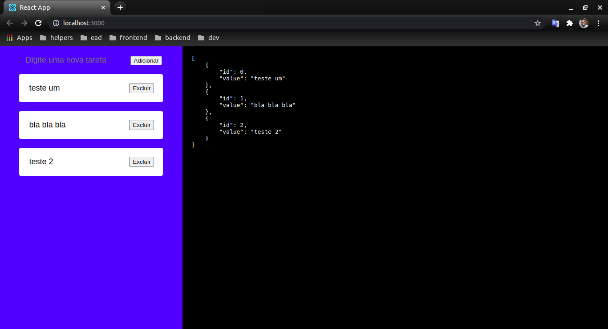

<h1 align="center">
     <a href="#" alt="">Lista hooks</a>
</h1>

<h4 align="center">
	🚧   Concluído 🚀 🚧
</h4>

Tabela de conteúdos
<!--ts-->
   * [Sobre o projeto](#-sobre-o-projeto)
   * [Funcionalidades](#-funcionalidades)
   * [Layout](#-layout)
   * [Como executar o projeto](#-como-executar-o-projeto)
     * [Pré-requisitos](#pré-requisitos)
     * [Rodando o Projeto](#user-content--rodando-o-projeto)
   * [Tecnologias](#-tecnologias)

<!--te-->


## 💻 Sobre o projeto

Lista com entrada e saida de dados, estilo to do (para fazer) 

---

## ⚙️ Funcionalidades

- [x] aprender sobre hooks

---

## 🎨 Layout

O layout da aplicação:

<p align="center">
  
</p>

---

## 🚀 Como executar o projeto

### Pré-requisitos

Antes de começar, você vai precisar ter instalado em sua máquina as seguintes ferramentas:
[Git](https://git-scm.com), [Node.js](https://nodejs.org/en/),[React](https://reactjs.org/)
Além disto é bom ter um editor para trabalhar com o código como [VSCode](https://code.visualstudio.com/)

#### 🎲 Rodando o Projeto

```bash
# Clone este repositório
$ git clone git@github.com:leandrojsantos/react.git

# Acesse a pasta do projeto no terminal/cmd, vá para a pasta raiz do projeto
$ cd reactjs/list-hooks

# Instale as dependências
$ npm install

# Execute a aplicação em modo de desenvolvimento
$ npm start

# O servidor inciará na porta:3000- acesse http://localhost:3000 

```
---

## 🛠 Tecnologias

As seguintes ferramentas foram usadas na construção do projeto:

* [React](https://reactjs.org/)
* [VSCode](https://code.visualstudio.com/)

---